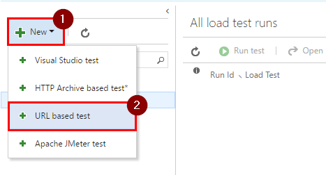
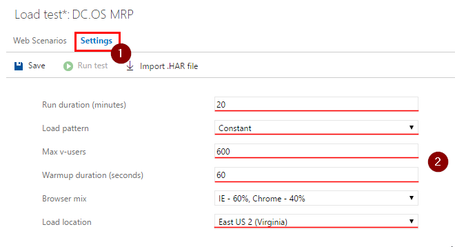
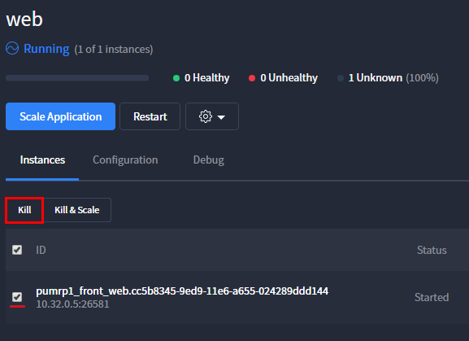
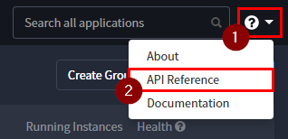
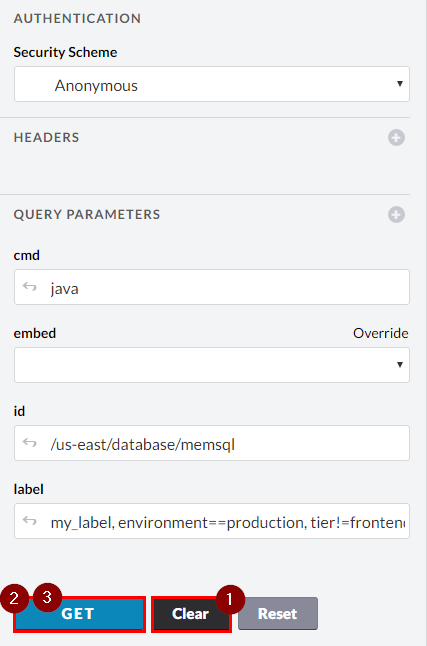
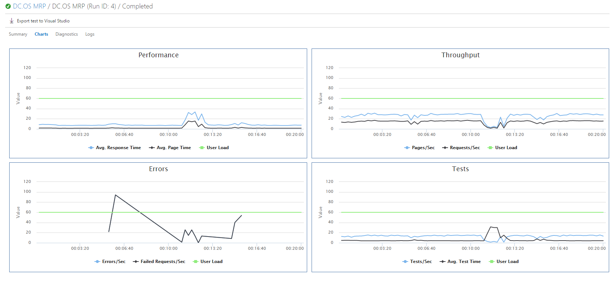
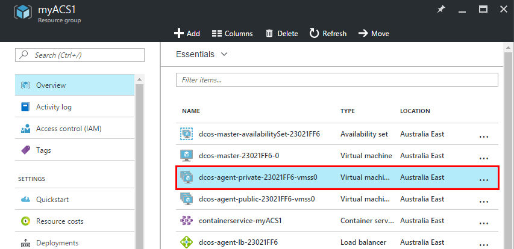
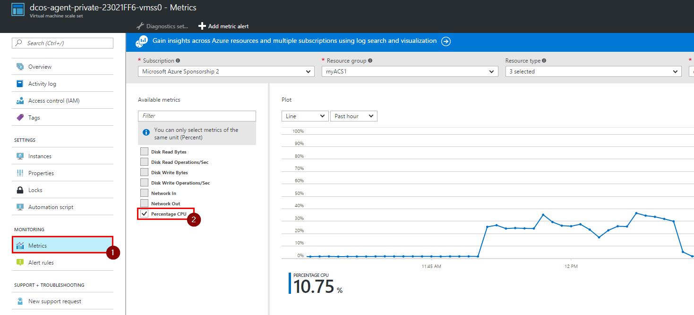

# Fault injection for Azure Container Services (ACS)

## Pre-requisites:

- [Deploying Parts Unlimited MRP on DC/OS](https://microsoft.github.io/PartsUnlimitedMRP/adv/adv-22-DCOS.html)
- Access to VSTS to run a load test

## Tasks Overview:
**1. Set up load test** This will walk your through creating and configuring a load test for the next task using VSTS.

**2. Inject faults into ACS environment using UI** In this task you will simulate faults of different parts of the system by killing its instances in Marathon service installed on DC/OS.

**3. Inject faults into ACS environment using API** In this task you will learn how to achieve exactly the same outcome as in the second task but using Marathon's API.

**4. Analyze results** In this task you will collect all of the information related to the load test and will draw a conclusion about the stability of the environment.

### Task 1: Set up load test

**Step 1.** Open VSTS for your project, then navigate to "Load Test" page.

**Step 2.** Click on "New" and select "URL based test".

**Step 3.** Give this load test a name, rename URL name into something more meaningful like `MainPage` and enter the MRP solution's URL into the URL field. This URL should be in the following format: `{YourDnsName}/mrp`, e.g. `http://myacsagents.australiaeast.cloudapp.azure.com/mrp/`.

**Step 4.** Click on "Add URL", give this URL a meaningful name like `API call to DB` and enter `{YourDnsName}/quotes?name` as a URL. This query will call your API, which then queries database.

**Step 5.** Click on "Settings" and enter the following settings:
* Run duration (minutes): `20`
* Load pattern: `Constant`
* Max v-users: `600`
* Warmup duration (seconds): `60`
* Browser mix: leave default value.
* Load location: Closest location to the datacenter where MRP solution is hosted.

> **Note:** 
> 1. `Run duration (minutes)`: specifies the duration of the test in minutes. 
> 2. `Load pattern`: has two options:  
> `Constant`: specifies the same amount of users that are going to be simulated throughout the test. 
> `Step`: specifies a constantly increasing amount of users that are going to be simulated until the maximum desired amount of users is reached. 
> 3. `Warmup duration (seconds)`: specifies time duration to gradually increase the amount of users. This allows web server to cache everything it needs before the load test starts. 
> 4. `Browser mix`: specifies a browser distribution for the users. 
> 5. `Load location`: specifies a datacenter's location from which all of the requests are going to be made.

**Step 6.** Click on "Save", then "Run test".
>**Note:** The 2 and/or 3 task(s) has to be done during the load test, so it's a good idea to read through it before you click "Run Test" button.

### Task 2: Inject faults into ACS environment using UI

**Step 1.** Navigate to `http://localhost/marathon` to open up Marathon service.

**Step 2.** Open "pumrp" folder and then "front".

**Step 3.** Click on "web" application.

**Step 4.** Select the application's instance and click on "Kill". At this stage Marathon will kill this instance and create one almost instantly. Every instance is a container, so it takes almost no time to spin it up.

The new instance will be hosted on a different machine or on the same one with a different port.

**Step 5.** Similarly, repeat previous steps for "db" application in "database" folder and "order" application in "api" folder. Make sure to spread out fault injections across the 20 minute period of the load test. This will allow the system to stabilize in-between the fault injections.

### Task 3: Inject faults into ACS environment using API

In this task you will learn how to inject faults using Marathon's API. This is an alternative way of injecting faults but it achieves exactly the same outcome as the Task 2.

**Step 1.** Open Marathon service again.

**Step 2.** Open API reference. You can make all of the available API calls using this page.

**Step 3.** Get applications' IDs by using the `GET /v2/apps` API call.

* Clear all query parameters, click "GET", then "Force GET".

    

* Scroll down and find the applications' IDs in the "Body" of the response. You will need these IDs in the next step, so note them.

  
  ...
  "id": "/pumrp/database/db",
  ...
  "id": "/pumrp/api/order",
  ...
  "id": "/pumrp/front/web",
  ...
  

* Close this API section by clicking on "close" button.

    

**Step 4.** Kill all tasks using `DELETE /v2/apps/{app_id}/tasks` API call in a particular app.
>**Note:** You can kill a specific instance in the app by using `DELETE /v2/apps/{app_id}/tasks/{task_id}` call but because we currently have only one instance in each application, we wouldn't see a difference (except for making an additional call).

1. Enter one of the IDs into the `app_id` field, e.g. `/pumrp/database/db`

2. In the body of your response, you will receive information about the instance that has been killed. At this point Marathon will create a new instance on a different machine or on the same one with a different port.

    >**Note:** You might potentially get a 503 response back, but the instance should have been killed.

**Step 5.** Similarly, repeat the previous step for IDs: `/pumrp/api/order` and `/pumrp/front/web`. Make sure to spread out fault injections across the 20 minute period of the load test. This will allow the system to stabilize in-between the fault injections.

### Task 4: Analyze results
Let's collect some of the related information to your load test and then analyze it.

**Step 1.** The most useful information is provided by the VSTS load test on the "Charts" tab.

**Step 2.** Another piece of useful information could the metrics provided by the Azure for Virtual Machine Scale Set (VMSS).

1. Open your resource group with the MRP solution in ACS, find the private VMSS and click on it.

    

2. Click on "Metrics" and select "Percentage CPU".

    

**Step 3.** 

* Now we can summaries the information received from the sources provided above. 
* The 3 spikes on the "Errors" graph indicate number of errors during the recreation of `front`, `db` and `api` instances (from left to right). 
* Fault of any of the system's part caused errors because the current ACS setup only has one instance of each part. 
* The "CPU usages" graph for the VMSS indicates under 50% CPU utilization of VMSS, meaning that there are enough resources to duplicate instance of each system's part. 
* You could also notice that the overall response time is rather slow, but this should be improved with more instances as well. 
* So the next action should be to set up more instances for each system's part and rerun the load test.

## Congratulations!
You've completed this HOL! In this lab you have learned how to configure and run load test using VSTS, inject faults into ACS environment managed by DC/OS (using Marathon's UI and API) and how to collect and analyze the information generated during the load test.

# Continuous Feedbacks

#### Issues / Questions about this HOL ??

[If you are encountering some issues or questions during this Hands on Labs, please open an issue by clicking here](https://github.com/Microsoft/PartsUnlimitedMRP/issues)

Thanks